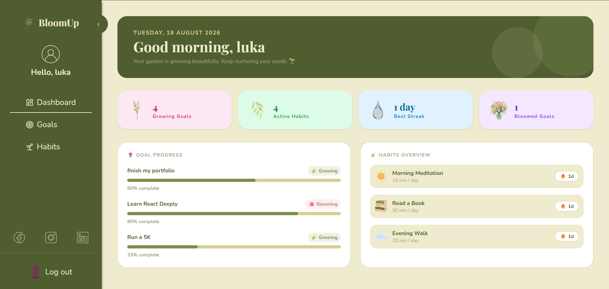

🌱 BloomUp
Grow better habits, one day at a time.

A habit-tracking and wellness web app where users can set personal goals, build daily habits, check in every day, and watch their streaks bloom. Built with React, styled with Tailwind, and designed around a calm, nature-inspired "garden" aesthetic.

📸 Preview


✨ Features

* 🔐 Authentication — sign up & log in, with protected routes for logged-in users only
* 🌿 Habit tracking — add habits from suggestions or create your own, check in daily, and build a streak
* ⏱️ Built-in timer — start/pause a live timer on any habit to track time spent
* 🎯 Goals with tasks — create goals, break them into tasks, and watch your progress bloom to 100%
* 📊 Dashboard overview — see your habits and goals progress at a glance
* 👤 Profile page — edit your display name and see your stats (best streak, active goals)
* 📱 Fully responsive — adaptive sidebar on desktop, bottom navigation on mobile
* 💾 Persistent data — real CRUD via a REST API (json-server), scoped per user

🛠️ Built With

* React 19 + React Router
* Tailwind CSS 4
* Context API (User, Goal, Habit providers) for global state
* Axios for API calls
* json-server as a local mock REST backend
* Vite

📁 Project Structure

```
bloomup/
├── src/
│   ├── api/            # Axios instance & API config
│   ├── assets/         # Images, SVG icons & backgrounds
│   ├── components/     # Reusable UI (cards, modals, sidebar, forms...)
│   ├── context/         # UserContext, GoalContext, HabitContext
│   ├── data/            # Static data (habit icons)
│   ├── hooks/           # useGoals, useHabits
│   ├── pages/           # Landing, Dashboard, Goals, Habits, Profile
│   ├── App.jsx          # Routes & providers
│   └── main.jsx         # Entry point
├── db.json              # Mock database for json-server
└── vite.config.js
```

🚀 Getting Started

This project needs a local mock backend (json-server) alongside the React app.

1. Clone the repository:
```
git clone https://github.com/msakni-malak/bloomup.git
cd bloomup
```

2. Install dependencies:
```
npm install
```

3. Start the mock API (in one terminal):
```
npx json-server --watch db.json --port 3001
```

4. Start the dev server (in another terminal):
```
npm run dev
```

5. Open the app at `http://localhost:5173` 🎉

💡 How It Works

1. Sign up or log in from the landing page
2. From the Habits page, pick a suggested habit or create your own
3. Check in every day to build your streak — miss a day and it resets 🍂
4. Create Goals and break them into small tasks; complete them all to make the goal "bloom" 🌸
5. Track everything from your Dashboard, and check your stats on your Profile

🔮 Potential Future Improvements

* Deploy with a real backend (currently uses json-server, meant for local/demo use)
* Add habit reminders/notifications
* Weekly/monthly progress charts
* Dark mode
* Compress and optimize image assets for production

👩‍💻 Author
Made with 🌿 by MALEK MSEKNI

* GitHub: [@msakni-malak](https://github.com/msakni-malak)

Small steps, real growth. 🌱